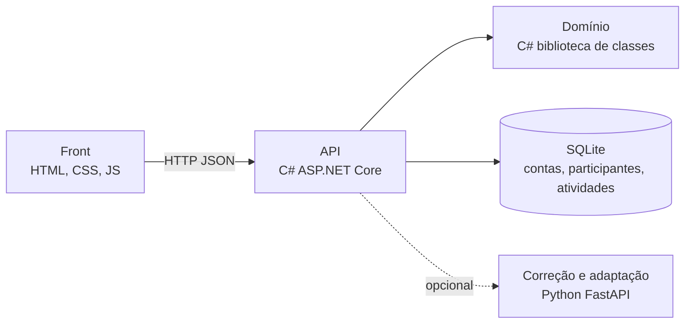
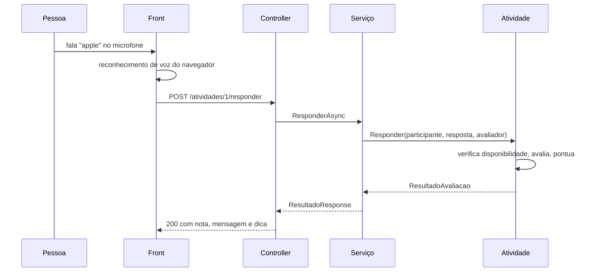

# 2. Arquitetura

O projeto tem quatro partes. O coração é a biblioteca de domínio em C#, onde vivem as classes; tudo o mais existe para servi-la ou para exibi-la.



## Por que separar domínio e API

A pasta `src/RoleDaFala.Dominio` é uma biblioteca de classes comum, sem ASP.NET, sem banco e sem nada da web. Isso traz três vantagens concretas.

Os testes ficam rápidos, porque testar uma regra não exige subir servidor. As regras ficam em um lugar só, então não há risco de a mesma validação aparecer diferente em dois controllers. E o domínio pode ser reaproveitado: se amanhã o grupo fizer um aplicativo de celular ou um programa de linha de comando, as mesmas classes servem.

A API, em `src/RoleDaFala.Api`, faz três coisas e só: recebe a requisição HTTP, chama o serviço e devolve o código de status certo. Ela não decide nada de negócio.

## As camadas

| Camada | Pasta | Responsabilidade |
| --- | --- | --- |
| Domínio | `src/RoleDaFala.Dominio` | Classes, regras e contratos. Não conhece HTTP nem banco |
| Aplicação | `src/RoleDaFala.Api/Servicos` | Orquestra o domínio e converte entidade em DTO |
| Apresentação | `src/RoleDaFala.Api/Controllers` | Traduz HTTP: rota, status e formato |
| Interface | `frontend/` | As telas, a voz e a acessibilidade |
| Persistência | `src/RoleDaFala.Api/Persistencia` | Fala com o SQLite: contas, participantes e atividades |

A dependência aponta sempre para dentro: o controller conhece o serviço, o serviço conhece o domínio, e o domínio não conhece ninguém.

## Injeção de dependência

O `Program.cs` é o único lugar que decide qual implementação usar:

```csharp
builder.Services.AddScoped<IParticipanteRepositorio, ParticipanteRepositorioSqlite>();
builder.Services.AddSingleton<IAvaliador>(_ =>
    new AvaliadorComSotaque(new AvaliadorPorSemelhanca()));
```

Nenhuma outra classe dá `new` num repositório ou num avaliador: todas recebem a interface pelo construtor. `RoleDaFala.Dominio.Repositorios.ParticipanteRepositorioEmMemoria` e `RepositorioEmMemoria<T>` continuam existindo, prontos e funcionais, exatamente por causa disso — trocar de volta para rodar sem banco (ou para quando os testes voltarem a existir) é mudar esta linha, nada mais.

## Fluxo de uma tentativa de pronúncia



Repare que quem soma o XP é a atividade, não o serviço. A regra fica junto dos dados a que ela pertence.

O reconhecimento de voz acontece no navegador, não no servidor. Isso economiza dados e evita mandar áudio pela rede, o que atende à prioridade de pouca internet.

## Endpoints

| Método | Caminho | O que faz |
| --- | --- | --- |
| GET | `/health` | Diz se a API está no ar |
| POST | `/participantes` | Cria um aluno ou um monitor |
| GET | `/participantes/{id}` | Busca um participante |
| GET | `/participantes` | Lista todos |
| PUT | `/participantes/{id}/apoios` | Atualiza os apoios de acessibilidade |
| POST | `/participantes/{id}/presenca` | Registra presença do dia |
| GET | `/atividades` | Lista as atividades |
| GET | `/atividades?participanteId=1` | Lista só as disponíveis para aquela pessoa |
| POST | `/atividades/{id}/responder` | Envia a resposta e recebe a nota |
| POST | `/contas/registrar` | Cria o participante e a conta de login (e-mail e senha) numa só chamada |
| POST | `/contas/login` | Confere e-mail e senha, devolve um token (JWT) e os dados do participante |

Com a API rodando, a documentação interativa fica em `http://localhost:5080/swagger`.

## Contas e autenticação

A conta de login (e-mail e hash de senha) é gravada num banco SQLite (`src/RoleDaFala.Api/roledafala.db`, ignorado pelo Git) — assim como participante e atividade agora, ela sobrevive a reiniciar a API. A senha nunca é guardada em texto puro: `Dominio/Seguranca/HashDeSenha.cs` deriva um hash com PBKDF2, só com a biblioteca padrão do .NET.

Depois de `/contas/login` ou `/contas/registrar`, a API devolve um token JWT. É o mesmo token que servirá tanto para o front web quanto, futuramente, para o app Android — nenhum dos dois vai depender de cookie de navegador.

`Conta` é uma entidade separada de `Participante` de propósito: uma é "como a pessoa entra", a outra é "quem ela é no app". `ParticipanteId` liga as duas; hoje isso não é uma foreign key de verdade no banco (ver [Próximos passos](#próximos-passos)), então apagar um participante direto no banco deixaria a conta órfã — o `ContaServico.LoginAsync` detecta esse caso e devolve um erro claro em vez de quebrar.

## O serviço em Python

O `ai-service/` cobre duas coisas, as duas simuladas por regras (não por um modelo de linguagem): a correção de frases escritas e, agora, a adaptação de conteúdo por perfil de acessibilidade (endpoint `/adaptar`, em `app/inclusao.py`). Ele é opcional: a API funciona sem ele, porque a avaliação de pronúncia foi levada para o domínio em C#, onde pode ser testada junto com as regras.

Ele fica como demonstração de integração entre serviços e como o lugar natural para, mais adiante, entrar um modelo de linguagem de verdade — tanto para a correção quanto para a adaptação de acessibilidade.

## Portas

| Parte | Porta |
| --- | --- |
| Front | 8000 |
| API C# | 5080 |
| Python | 8001 |

## Decisões e por quê

**Por que controllers e não minimal API.** Controllers deixam explícitas as camadas, os atributos de rota e os códigos de resposta, e são mais fáceis de testar em isolamento. Como a API entra na avaliação, a clareza vale mais que a brevidade.

**Por que repositório em memória existia (e ainda existe como opção).** Para rodar sem instalar banco bastava clonar e dar `dotnet run`. `Conta` foi a primeira a trocar para Entity Framework com SQLite — uma nova classe implementando a interface do repositório (`ContaRepositorioSqlite : IContaRepositorio`) e algumas linhas no `Program.cs`, sem tocar no domínio — e participante e atividade seguiram o mesmo caminho logo depois. `ParticipanteRepositorioEmMemoria` e `RepositorioEmMemoria<T>` continuam no domínio, então voltar a rodar sem banco é só trocar de novo a linha do `Program.cs`.

**Por que Participante e Atividade não são mapeados direto pelo EF Core.** As duas classes escondem seu estado de propósito (Xp e DiasSeguidos só mudam por `GanharXp`/`RegistrarPresenca`; `Enunciado` e as respostas aceitas nem têm setter) — é o núcleo de POO do projeto, e forçar o EF Core a violar isso (expondo setters públicos só para o banco conseguir gravar) estragaria o motivo de a classe existir. Em vez disso, `ParticipanteRegistro` e `AtividadeRegistro` (em `Persistencia/`) são o formato "achatado" que vai para o SQLite, e `ParticipanteRepositorioSqlite`/`AtividadeRepositorioSqlite` convertem nos dois sentidos — para reconstruir a entidade ao ler do banco, eles chamam os mesmos métodos públicos que qualquer outro código usaria (`GanharXp`, `RegistrarPresenca`, `Acessibilidade.Adicionar`...), nunca acessam campo privado.

**Por que a exceção do domínio vira 400 e não 500.** Nome vazio não é falha do servidor: é uso incorreto. O controller captura `DominioException` e devolve 400 com a mensagem, para o front poder mostrá-la à pessoa.

## Próximos passos

Combinado após a primeira reunião de alinhamento do grupo, ainda sujeito a mudar:

- ~~Persistir participante e atividade~~ — feito: contas, participantes e atividades já gravam no SQLite.
- **Migrations de verdade.** O banco hoje é criado com `EnsureCreatedAsync` (ver `Program.cs`), que cria as tabelas do zero mas não sabe evoluir um esquema já existente. O passo seguinte é `dotnet ef migrations add`, para versionar mudanças de schema em vez de recriar o banco.
- **Chave JWT fora do código.** A chave em `appsettings.json` é só de desenvolvimento (está comentada como tal). Antes de qualquer uso real, mover para variável de ambiente ou `dotnet user-secrets`.
- **Foreign key entre Conta e Participante.** Hoje `Conta.ParticipanteId` é só um número guardado, sem restrição no banco — ver [Contas e autenticação](#contas-e-autenticação).
- **Android.** A API já fala JSON puro com JWT, então não deve exigir mudança para atender um app Android. O esqueleto do projeto Android está em `android/` (ver [`android/README.md`](../android/README.md)) — sem tela funcional ainda, só a estrutura para o time continuar depois da reunião.
- **IA de adaptação de acessibilidade.** O endpoint `/adaptar` do `ai-service` começa como regra fixa (ver `app/inclusao.py`); a ideia é evoluir para um modelo de verdade, do mesmo jeito que já está planejado para a correção de texto.
- **Testes.** Os projetos de teste (`tests/RoleDaFala.Testes` e `ai-service/tests`) foram removidos de propósito nesta mudança de arquitetura — inclusive a "casca" (`.csproj`, `pytest.ini`) — para serem recriados do zero a partir do novo desenho, e não dos requisitos antigos.
