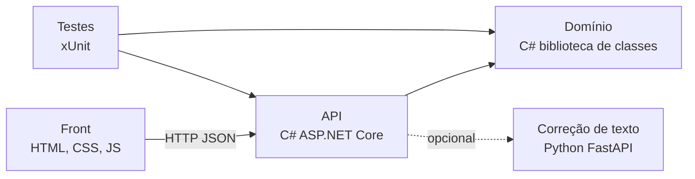
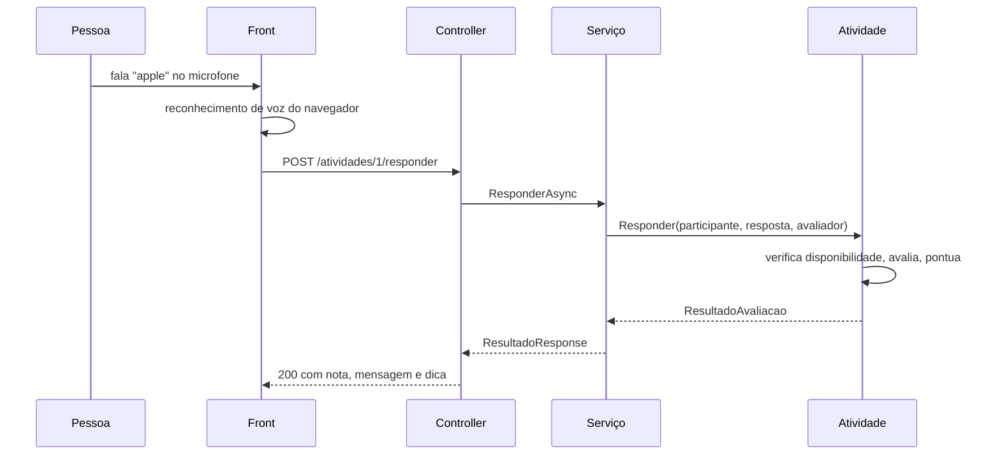

# 2. Arquitetura

O projeto tem quatro partes. O coração é a biblioteca de domínio em C#, onde vivem as classes; tudo o mais existe para servi-la ou para exibi-la.



## Por que separar domínio e API

A pasta `src/RoleDaFala.Dominio` é uma biblioteca de classes comum, sem ASP.NET, sem banco e sem nada da web. Isso traz três vantagens concretas.

Os testes ficam rápidos, porque testar uma regra não exige subir servidor. As regras ficam em um lugar só, então não há risco de a mesma validação aparecer diferente em dois controllers. E o domínio pode ser reaproveitado: se amanhã o grupo fizer um aplicativo de celular ou um programa de linha de comando, as mesmas classes servem.

A API, em `src/RoleDaFala.Api`, faz três coisas e só: recebe a requisição HTTP, chama o serviço e devolve o código de status certo. Ela não decide nada de negócio.

## As camadas

| Camada | Pasta | Responsabilidade |
| --- | --- | --- |
| Domínio | `src/RoleDaFala.Dominio` | Classes, regras e contratos. Não conhece HTTP nem banco |
| Aplicação | `src/RoleDaFala.Api/Servicos` | Orquestra o domínio e converte entidade em DTO |
| Apresentação | `src/RoleDaFala.Api/Controllers` | Traduz HTTP: rota, status e formato |
| Interface | `frontend/` | As telas, a voz e a acessibilidade |
| Testes | `tests/RoleDaFala.Testes` | 58 testes, do domínio e da API |

A dependência aponta sempre para dentro: o controller conhece o serviço, o serviço conhece o domínio, e o domínio não conhece ninguém.

## Injeção de dependência

O `Program.cs` é o único lugar que decide qual implementação usar:

```csharp
builder.Services.AddSingleton<IParticipanteRepositorio, ParticipanteRepositorioEmMemoria>();
builder.Services.AddSingleton<IAvaliador>(_ =>
    new AvaliadorComSotaque(new AvaliadorPorSemelhanca()));
```

Nenhuma outra classe dá `new` num repositório ou num avaliador: todas recebem a interface pelo construtor. É isso que permite os testes trocarem o repositório real por um em memória sem alterar uma linha do serviço.

## Fluxo de uma tentativa de pronúncia



Repare que quem soma o XP é a atividade, não o serviço. A regra fica junto dos dados a que ela pertence.

O reconhecimento de voz acontece no navegador, não no servidor. Isso economiza dados e evita mandar áudio pela rede, o que atende à prioridade de pouca internet.

## Endpoints

| Método | Caminho | O que faz |
| --- | --- | --- |
| GET | `/health` | Diz se a API está no ar |
| POST | `/participantes` | Cria um aluno ou um monitor |
| GET | `/participantes/{id}` | Busca um participante |
| GET | `/participantes` | Lista todos |
| PUT | `/participantes/{id}/apoios` | Atualiza os apoios de acessibilidade |
| POST | `/participantes/{id}/presenca` | Registra presença do dia |
| GET | `/atividades` | Lista as atividades |
| GET | `/atividades?participanteId=1` | Lista só as disponíveis para aquela pessoa |
| POST | `/atividades/{id}/responder` | Envia a resposta e recebe a nota |

Com a API rodando, a documentação interativa fica em `http://localhost:5080/swagger`.

## O serviço em Python

O `ai-service/` continua no repositório, com a correção de frases escritas e os seus 11 testes. Ele é opcional: a API funciona sem ele, porque a avaliação de pronúncia foi levada para o domínio em C#, onde pode ser testada junto com as regras.

Ele fica como demonstração de integração entre serviços e como o lugar natural para, na etapa 10, entrar um modelo de linguagem de verdade.

## Portas

| Parte | Porta |
| --- | --- |
| Front | 8000 |
| API C# | 5080 |
| Python | 8001 |

## Decisões e por quê

**Por que controllers e não minimal API.** Controllers deixam explícitas as camadas, os atributos de rota e os códigos de resposta, e são mais fáceis de testar em isolamento. Como a API entra na avaliação, a clareza vale mais que a brevidade.

**Por que repositório em memória.** Para rodar sem instalar banco: clonar e dar `dotnet run` basta. A troca por Entity Framework com SQLite é uma nova classe que implementa `IRepositorio<T>` e uma linha no `Program.cs`. Nada mais muda, e é justamente isso que a interface garante.

**Por que a exceção do domínio vira 400 e não 500.** Nome vazio não é falha do servidor: é uso incorreto. O controller captura `DominioException` e devolve 400 com a mensagem, para o front poder mostrá-la à pessoa.
