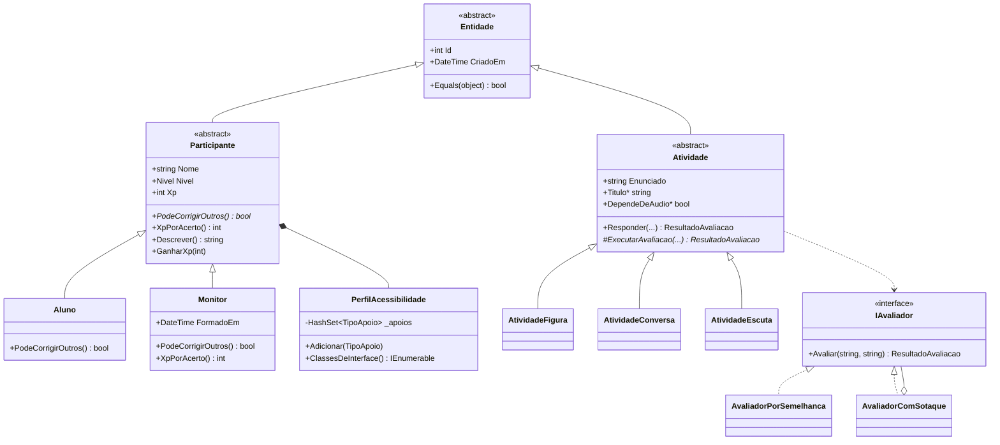

# 3. Modelagem Orientada a Objetos

Este documento aponta onde cada conceito de orientação a objetos está no código, com o arquivo e a razão de estar ali. A ideia é que a escolha resolva um problema real do app, não que exista só para cumprir requisito.

## Diagrama de classes



## Onde cada conceito está

| Conceito | Arquivo | Como aparece |
| --- | --- | --- |
| Abstração | `Entidade.cs`, `Participante.cs`, `Atividade.cs` | Três classes `abstract` que não podem ser instanciadas: só existem alunos e monitores, figuras e conversas |
| Herança | `Aluno.cs`, `Monitor.cs`, `AtividadeFigura.cs` | Aluno e Monitor herdam de Participante; as três atividades herdam de Atividade |
| Polimorfismo | `Participante.PodeCorrigirOutros()`, `Atividade.ExecutarAvaliacao()` | Uma lista de `Atividade` guarda os três tipos e cada um se avalia do seu jeito, sem `if` no chamador |
| Encapsulamento | `Participante.Nome`, `PerfilAcessibilidade` | Validação dentro do `set`; a coleção interna é privada e só sai como somente leitura |
| Interface | `IAvaliador.cs`, `IRepositorio.cs` | Contratos que permitem trocar a implementação sem mexer no resto |
| Sobrescrita | `Entidade.Equals()`, `Monitor.Descrever()` | `override` de métodos herdados, inclusive de `Object` |
| Sobrecarga | `PerfilAcessibilidade.Adicionar()` com `TipoApoio.Nenhum` | O mesmo método trata o caso de limpar tudo |
| Composição | `Participante` tem um `PerfilAcessibilidade` | O perfil não existe sozinho: nasce e morre com o participante |
| Genéricos | `IRepositorio<T> where T : Entidade` | Um contrato serve para qualquer entidade, com restrição de tipo |
| Herança de interface | `IParticipanteRepositorio : IRepositorio<Participante>` | Aproveita o contrato genérico e acrescenta buscas próprias |
| Exceção própria | `DominioException.cs` | Separa erro de regra de negócio de erro técnico; a API converte em HTTP 400 |
| Objeto de valor | `ResultadoAvaliacao.cs` | `record` imutável, sem Id: dois resultados iguais são equivalentes |

## Três decisões que vale explicar na apresentação

**Por que `Monitor.XpPorAcerto()` devolve zero.** É polimorfismo resolvendo uma regra real: o monitor não está competindo com os alunos, então não acumula pontos. O código que chama não sabe se está lidando com aluno ou monitor, e nem precisa saber.

**Por que `Atividade.Responder()` não é virtual.** É o padrão Template Method. O passo a passo é sempre o mesmo: verificar se a atividade está disponível, avaliar e pontuar. O que muda entre as filhas é só a avaliação, e é por isso que só `ExecutarAvaliacao()` é abstrato. Assim nenhuma filha pode esquecer de pontuar ou de verificar a disponibilidade.

**Por que `AvaliadorComSotaque` recebe outro avaliador em vez de herdar dele.** É o padrão Decorator, e a razão é prática: no futuro, o avaliador interno vai ser um serviço de fala de verdade. Com composição, basta trocar o que é passado no construtor. Com herança, seria preciso reescrever a classe.

## Regras de negócio cobertas por teste

- Nome com menos de duas letras é recusado.
- XP negativo é recusado.
- O nível sobe com o XP e nunca desce.
- Aluno só corrige colega a partir do nível intermediário; monitor sempre pode.
- Monitor acerta a atividade mas não acumula XP.
- Cegueira e baixa visão não convivem no mesmo perfil.
- Atividade que depende de áudio não aparece para quem marcou surdez.
- Atividade acima do nível da pessoa não pode ser respondida.
- O avaliador com sotaque perdoa erros conhecidos e repassa o resto.
- O controller devolve 201, 400 e 404 nos casos certos.

## Rodando os testes

```bash
dotnet test
```

São 58 métodos de teste (56 `[Fact]` e 2 `[Theory]`), divididos entre o domínio e a API. Com os casos de `[InlineData]`, o total executado é 63.
